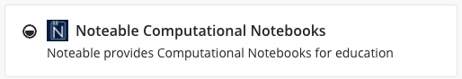

# COMP2870 Theoretical Foundations of Computer Science II: Lab exercises for Linear Algebra

## How to access the lab

You can access the lab worksheet directly through [minerva](https://minerva.leeds.ac.uk/) or [github](https://github.com/COMP2870-2526/linear-algebra-student-labs).

You can also use the *Noteable compute service*. To access Noteable, navigate in minerva to the correct module, select "Noteable Computational Notebooks":

.

This opens the Noteable interface. Choose "Standard Python 3 with VS code editor" from the drop down list in the Green box then select start:

Then from the Launcher menu select "Python 3 kernel (ipython)" (yellow box) or "VSCode IDE" (green box):

Python 3 kernel is a standard jupyter lab interface that requires no set up. 
VSCode IDE brings up online VS Code editor, very similar to github class rooms, which requires some additional set up to work.

You can access the lab notebooks in the directory "shared-data-202526_41390_COMP2870". Ensure that you copy the files

The [Noteable user guide](https://noteable.edina.ac.uk/user-guide/) provides more information.

These lab worksheets are written using ['Jupyter Notebooks'](https://jupyter.org/). Many, many tutorials and guides are [available online](https://www.dataquest.io/blog/jupyter-notebook-tutorial/).